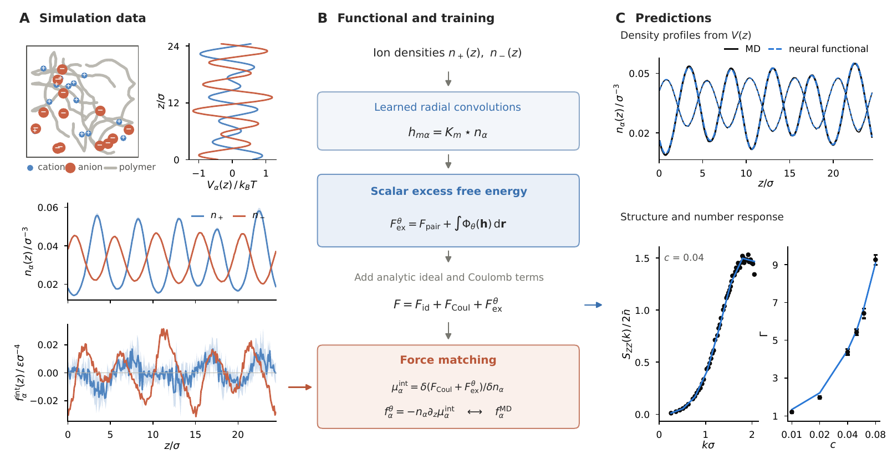
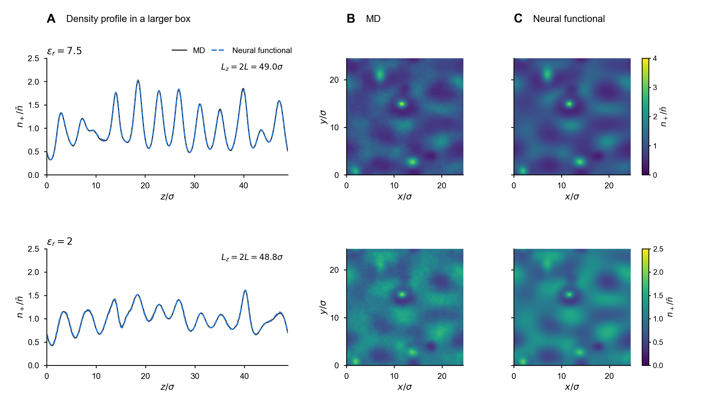

<div align="center">

# Neural density functionals for polymer electrolytes

**A structure-preserving neural density functional for the ions of a polymer electrolyte**<br>
Liyao Lyu

[Manuscript](https://github.com/Lyuliyao/CDFT-electrolytes) · [Reproduce the results](docs/reproduction.md) · [Data and models](docs/data.md) · [Simulation model](code/md/README.md)




</div>

Learn the correlations beyond the analytic Coulomb mean field from molecular-dynamics force densities. Radial kernels and a scalar free-energy readout preserve integrability and continuous spatial symmetries. The resulting functional predicts ion profiles, bulk structure and finite-wavenumber number response.

## Results at a glance

Mean relative profile errors across the paper's 20 held-out runs and 22 runs at the untrained concentration `c = 0.05`:

| Dielectric constant | Neural functional | Learned pair closure |
| :--- | ---: | ---: |
| 7.5 | **1.16%** | 2.97% |
| 2 | **1.99%** | 5.65% |

The test domain spans `c = 0.01–0.08`. Each dielectric constant uses its own trained model. The manuscript and supplementary information define the broader architecture comparison, convergence criteria and uncertainty estimates. [Exact values and selected fits](results/tables/paper-results.json).

## Start here

The result check uses Python's standard library and does not train a model:

```sh
python scripts/reproduce.py verify
```

To install the computational environment and redraw the generalization figure:

```sh
python3.12 -m venv .venv
.venv/bin/python -m pip install -r requirements.txt
.venv/bin/python scripts/reproduce.py figure --figure 3
```



## Repository guide

| Directory | Contents |
| :--- | :--- |
| [`code/learn`](code/learn) | JAX functionals, force matching, canonical solvers and bulk response |
| [`code/md`](code/md) | Coarse-grained LAMMPS inputs and profile-processing tools |
| [`code/figures`](code/figures) | Figure reconstruction and numerical-analysis helpers |
| [`data/md`](data/md) | Processed profiles, applied potentials, bulk summaries and data splits |
| [`data/models`](data/models) | Model configurations, checkpoints and per-run evaluations |
| [`data/predictions`](data/predictions) | Larger-box and nonplanar evaluation summaries |
| [`results`](results) | Final manuscript figures, archived figure arrays and canonical numerical tables |
| [`docs`](docs) | Reproduction instructions and data conventions |

The manuscript is maintained in the separate [CDFT-electrolytes repository](https://github.com/Lyuliyao/CDFT-electrolytes). Raw MD trajectories and restart files are stored separately. The compact nonplanar arrays needed to redraw Figure 3 are included; recomputing all maps or trajectory uncertainties requires the raw data.

Use GitHub's **Cite this repository** button for the software citation. Add the manuscript's archival identifier when it becomes available.
